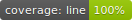

# SOAP Web Service Testing Project

# Introductie
Deze repository bevat de 4 verschillende soorten tests die moeten worden opgeleverd voor de groepsopdracht.

# Pipelines
De pipeline bevind zich in de .github/workflows folder. Deze pipeline zorgt ervoor dat de tests in parallel worden uitgevoerd en de coverage wordt gegenereerd. De coverage is hierboven zichtbaar in de readme. 

# Unit Tests
De unit tests zijn gemaakt in c# met behulp van xUnit. De unit tests zijn te vinden in de WebShopUnitTests folder. De unit tests zijn te runnen met het commando `dotnet test` in de WebShopUnitTests folder. De coverage is te vinden in de WebShopUnitTests/TestResults folder.

# Performance Tests
De performance tests zijn gemaakt in c# met behulp van xUnit. De testen zijn zelf gebouwd en runnen 6 lineaire requests en 6 opbouwende parallelle requests. Er wordt getest op de SLA van 300ms

# Api Tests
De api tests zijn gemaakt in c# met behulp van xUnit. De api tests zijn te vinden in de WebShopApiTests folder. Hierbij wordt de soap client gebruikt om de api te testen.

# GUI Tests
De gui tests zijn gemaakt in Katalon Studio en runnen in Saucelabs in de pipeline wordt het ook in Saucelabs gerund.